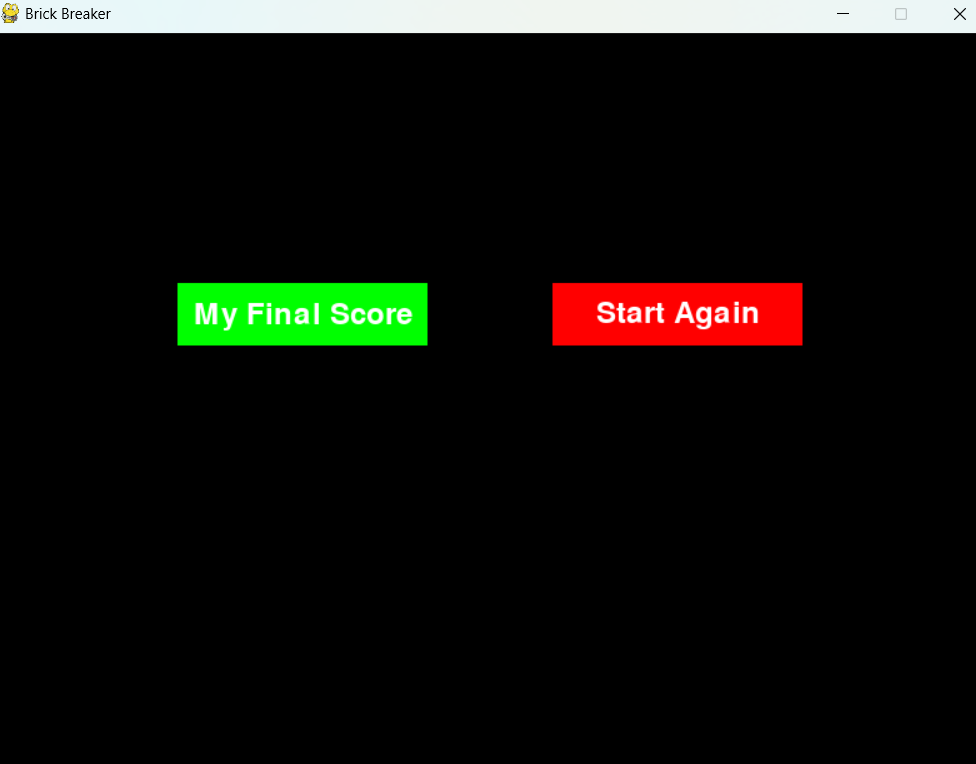
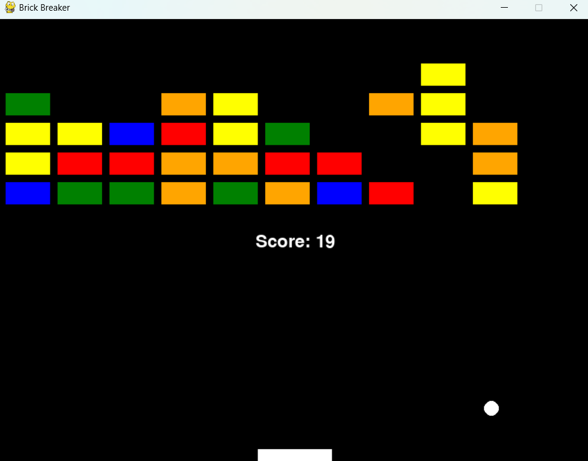

---

# Brick Breaker Game

Brick Breaker is a classic arcade game where the player controls a paddle to bounce a ball and break bricks. The goal is to clear all the bricks from the screen using the ball without letting it fall off the bottom of the screen.

## How to Play

- Use the left and right arrow keys to move the paddle.
- Bounce the ball off the paddle to hit and break the bricks.
- If the ball falls off the bottom of the screen, the game ends.
- Clear all the bricks to win the game.

## Features

- Randomized brick colors add variety to the gameplay.
- Dynamic ball movement increases the challenge.
- Score tracking to keep track of your progress.
- "My Final Score" button displays your final score after the game ends.
- "Start Again" button allows you to restart the game.

## Controls

- Left Arrow Key: Move paddle left.
- Right Arrow Key: Move paddle right.

## Requirements

- Python 3.x
- Pygame library

## Installation

1. Clone the repository to your local machine:

   ```
   git clone https://github.com/Amit-Chandra/brick-breaker.git
   ```

2. Navigate to the project directory:

   ```
   cd brick-breaker
   ```

3. Install the required dependencies:

   ```
   pip install -r requirements.txt
   ```

## Usage

1. Run the game:

   ```
   python brick_breaker.py
   ```

2. Follow the on-screen instructions to play the game.

## Credits

This game is created by [Amit Chandra]. Feel free to contribute and improve the game!

##Game Screenshots





---
